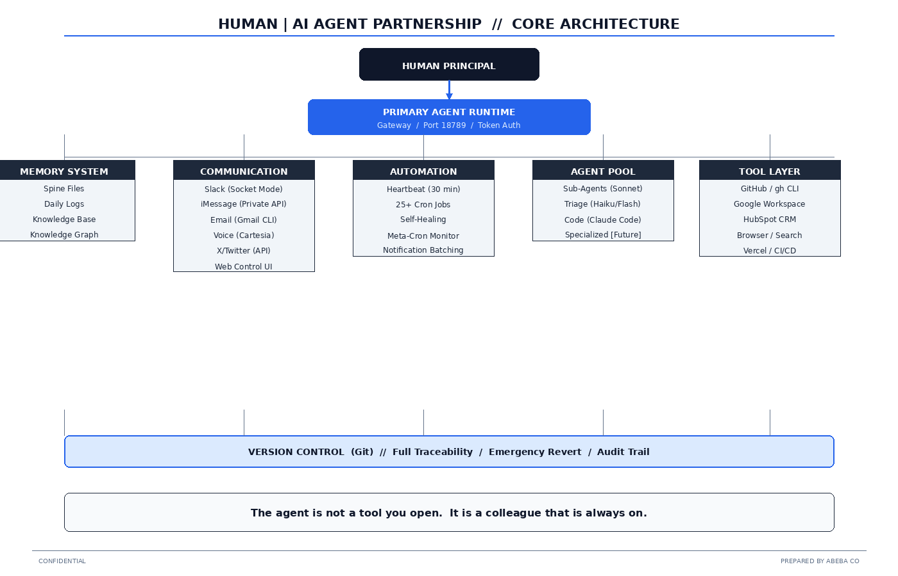
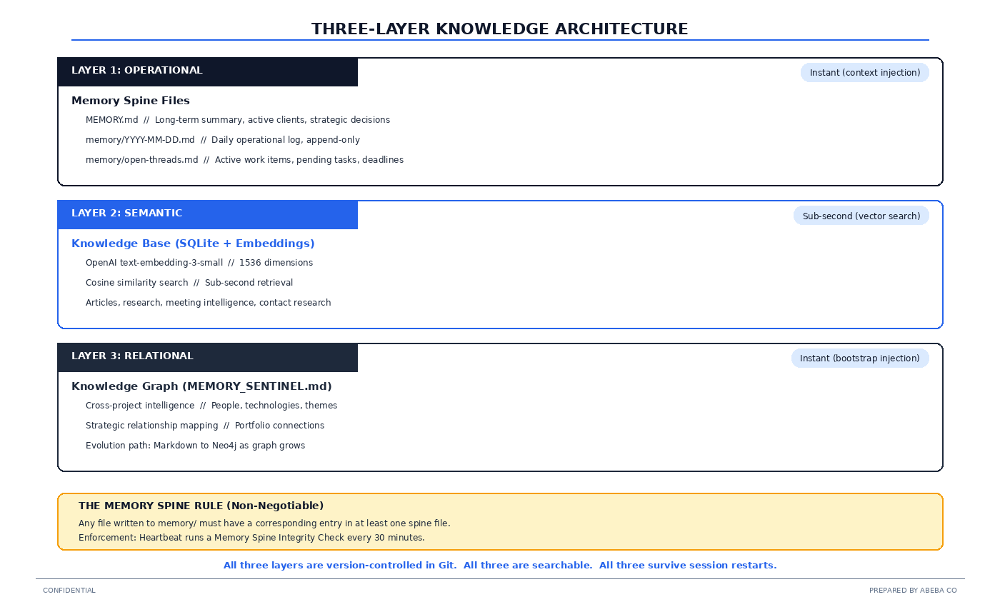
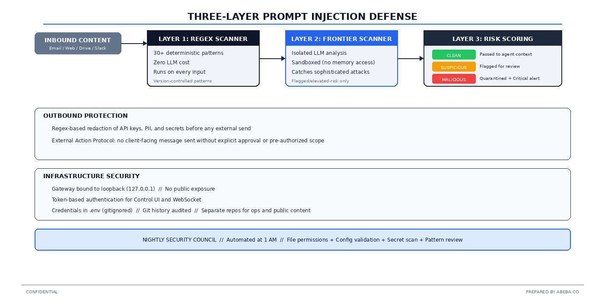
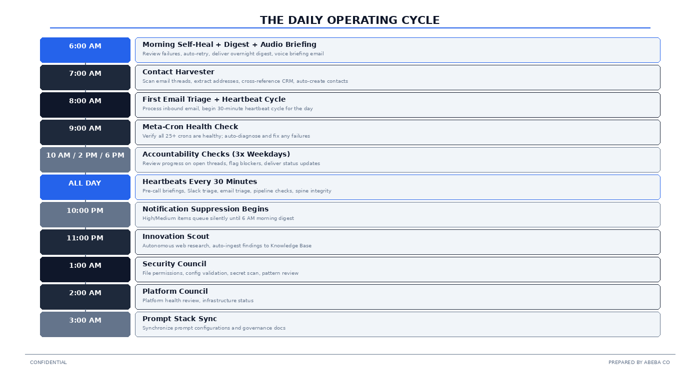
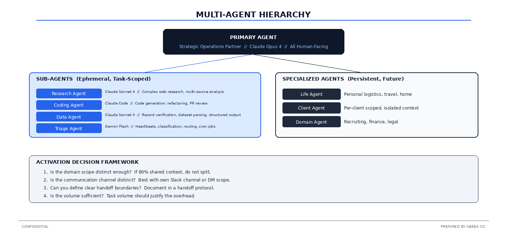
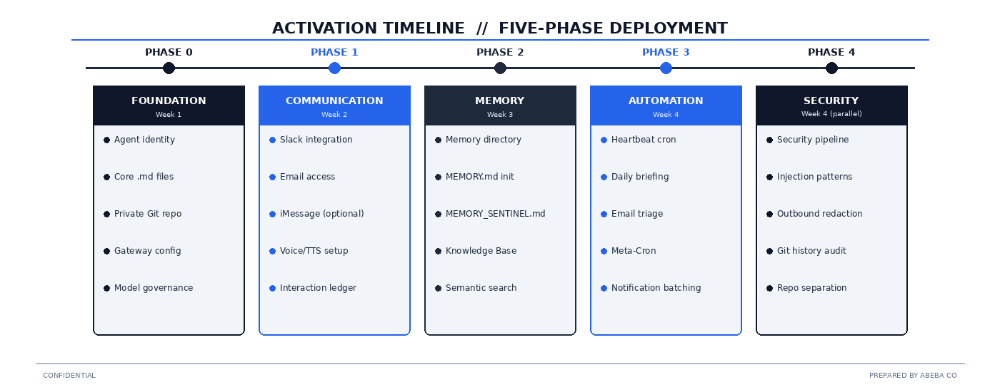
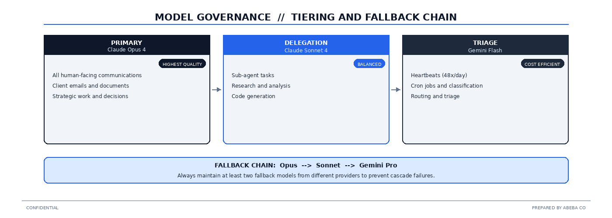

# Human | AI Agent Partnership Handbook

### An OpenClaw Agentic AI Technical Implementation Handbook

> "Every company in the world today needs to have an OpenClaw strategy, an agentic system strategy.  This is the new computer."
>
> -- Jensen Huang, CEO NVIDIA, GTC 2026

---

## What This Is

This is the production handbook for activating a **Human | AI Agent Partnership** on [OpenClaw](https://github.com/openclaw/openclaw).  Not theory.  Not a demo.  The actual architecture, security model, memory system, communication topology, knowledge management layer, and operational discipline that runs in production at [Abeba Co](https://www.abeba.co).

The Human | AI Agent Partnership gives one person the operational capacity of ten without adding headcount.  The agent operates 24/7 across Slack, iMessage, email, voice, and social media.  It maintains its own memory, manages CRM, runs 25+ automated workflows, conducts nightly security audits, and reports status without being asked.

**Annual cost: ~$15,650.  Human equivalent: $150,000+.**

---

## Quick Start

1. **[Download the Handbook (PDF)](handbook/Human_AI_Agent_Partnership_Handbook_V3.pdf)** -- The complete 35-page implementation guide.
|   |
|   |-- archive/                 # Previous versions
|   |   |-- Human_AI_Agent_Partnership_Handbook_V2_FINAL.pdf
2. **Copy the [templates/](templates/)** directory into your private ops repo.
3. **Customize each `.md` file** for your organization.
4. **Follow the [Activation Checklist](handbook/Human_AI_Agent_Partnership_Handbook_V3.pdf)** (Chapter 13) -- 5 phases, 5 weeks.
|   |
|   |-- archive/                 # Previous versions
|   |   |-- Human_AI_Agent_Partnership_Handbook_V2_FINAL.pdf

Or visit **[abeba.co/handbook](https://www.abeba.co/handbook)** for the full handbook with advisory support.

---

## Repository Structure

```
human-ai-agent-partnership-handbook/
|
|-- README.md                    # You are here
|-- LICENSE
|
|-- handbook/                    # The complete handbook
|   |-- Human_AI_Agent_Partnership_Handbook_V3.pdf
|   |
|   |-- archive/                 # Previous versions
|   |   |-- Human_AI_Agent_Partnership_Handbook_V2_FINAL.pdf
|
|-- templates/                   # Production-ready starter files (Chapter 16, Addendum A)
|   |-- SOUL.md                  # Agent personality and boundaries
|   |-- IDENTITY.md              # Agent professional profile
|   |-- USER.md                  # Principal (human) profile
|   |-- AGENTS.md                # Mission control and session protocol
|   |-- TOOLS.md                 # Infrastructure inventory
|   |-- HEARTBEAT.md             # Autonomous 30-min task list
|   |-- SESSION_STARTUP.md       # Boot sequence definition
|
|-- diagrams/                    # Architecture visuals (high-res PNG)
|   |-- README.md                # Diagram index
|
|-- examples/                    # Reference configurations
|   |-- gateway-config.json      # Sample OpenClaw gateway config
|   |-- injection-patterns.txt   # Starter prompt injection regex patterns
|
|-- concepts/                   # Companion essays and frameworks
|   |-- BOUNDED_HARNESS.md       # Why constraints create capability (the philosophical foundation)
|
|-- CONTRIBUTING.md              # How to submit your activation story
|-- CASE_STUDIES.md              # Community activation stories
```

---

## What Is the Human | AI Agent Partnership?

It is **not** a chatbot.  It is **not** a copilot.  It is a persistent, autonomous operating partner that:

- **Maintains memory across sessions** -- version-controlled, searchable, with semantic embeddings
- **Communicates on multiple surfaces** -- Slack, iMessage, email, voice, social media
- **Runs 25+ automated workflows** -- email triage, CRM updates, meeting prep, security audits, innovation research
- **Self-heals** -- monitors its own crons, retries failures, logs lessons learned
- **Operates under governance** -- model tiering, cost controls, security layers, audit trails
- **Commits its own work to git** -- full traceability, emergency revert, blame history

The handbook covers every layer: identity, security, memory, knowledge management (vector embeddings + knowledge graphs), communication channels, automation, model governance, version control, CRM integration, multi-agent architecture, and monitoring.

---

## The Three-Layer Knowledge Architecture

| Layer | System | Purpose |
|-------|--------|---------|
| **Operational** | Memory spine (MEMORY.md, daily logs, open-threads) | What happened, what is pending, what decisions were made |
| **Semantic** | Knowledge Base (SQLite + OpenAI embeddings) | Deep recall across articles, research, meeting history |
| **Relational** | Knowledge Graph (cross-project intelligence) | How things connect across projects, people, and themes |

---


## Companion Reading: The Bounded Harness

> "The model is 20% of the value.  The operating environment is 80%."

The [Bounded Harness](concepts/BOUNDED_HARNESS.md) is the philosophical foundation behind this handbook.  It explains why constrained, measured, reversible agent tasks outperform open-ended freedom, drawing on Karpathy's Autoresearch and our own production experience.

Every chapter in the handbook is a component of the Bounded Harness.  The handbook is the practical implementation.  The Bounded Harness is the *why*.

Read the full essay: [concepts/BOUNDED_HARNESS.md](concepts/BOUNDED_HARNESS.md)
Blog post: [abeba.co/blog/bounded-harness](https://www.abeba.co/blog/bounded-harness)

## Architecture Diagrams

<details>
<summary>📐 Click to expand all 7 diagrams</summary>

### System Architecture


### Three-Layer Knowledge Architecture


### Security Defense Pipeline


### Daily Operating Cycle


### Multi-Agent Hierarchy


### Activation Timeline


### Model Governance


</details>

## Who This Is For

- **Agency leaders** exploring AI transformation
- **Technical founders** building AI-native operations
- **Engineering teams** evaluating OpenClaw for enterprise deployment
- **Anyone** who wants to give one person the capacity of ten

---

## Built With

- [OpenClaw](https://github.com/openclaw/openclaw) -- Agent runtime, gateway, cron engine, multi-channel messaging
- [Anthropic Claude](https://anthropic.com) -- Primary and delegation models
- [Google Gemini](https://deepmind.google/technologies/gemini/) -- Triage and heartbeat models
- [HubSpot](https://hubspot.com) -- CRM integration
- [Cartesia](https://cartesia.ai) -- Voice / Text-to-Speech (40ms TTFA)
- [imessage-rs](https://github.com/nicktrav/imessage-rs) -- iMessage bridge for macOS

---

## Contributing

Activated your own Human | AI Agent Partnership?  We want to hear about it.

1. Fork this repo
2. Add your story to `CASE_STUDIES.md`
3. Submit a pull request

Or email **michael@abeba.co** with your activation story.

---

## License

This handbook and all templates are provided under the [MIT License](LICENSE).  Use them freely.  Build on them.  If you do, we would appreciate a reference to [Abeba Co](https://www.abeba.co) and a link back to this repository.

---

**Prepared by [Abeba Co](https://www.abeba.co)**  //  michael@abeba.co  //  abbie@abeba.co
